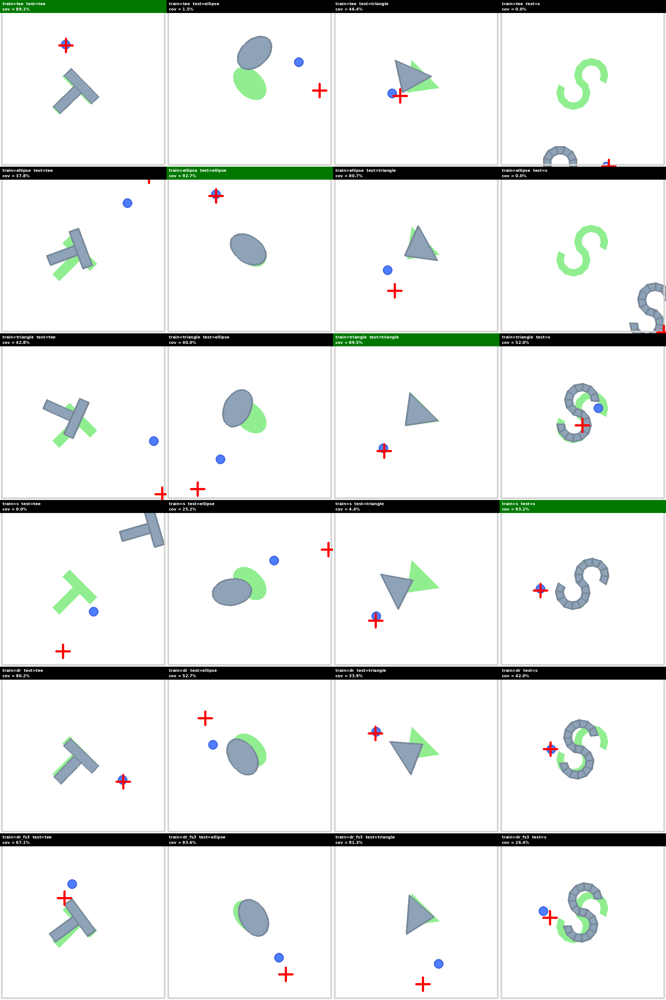
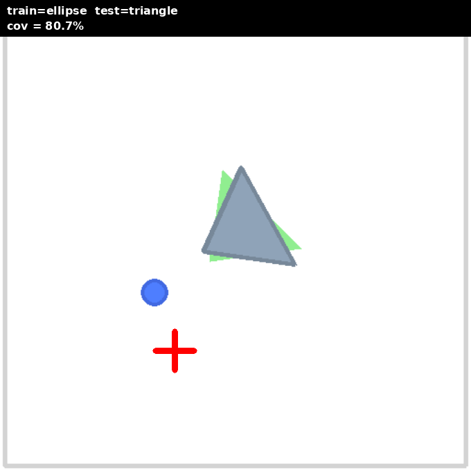
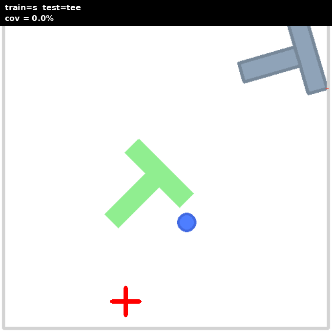
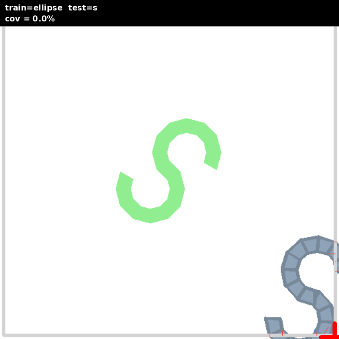

# Push-T Cross-Shape Transfer Matrix

**Date:** 2026-04-21
**Author:** this session
**TL;DR:** Trained 5 SAC policies (T, ellipse, triangle, S — specialists — plus a domain-randomized policy mixing all 4) on the vendored `gym-pusht` env. Measured a 5×4 cross-shape transfer matrix. Specialists reach 87–93% mean coverage on their own shape. Off-diagonal transfer ranges from 0% (S-trained on anything else) to 81% (ellipse-trained on triangle). The **domain-randomized (DR)** policy is the best generalist — it lands within 15 pp of the specialist on every test shape with one policy, something no single-shape policy achieves.

## Setup

### Shapes
Four pymunk block shapes live in `jax_rl/envs/manipulation/pusht/shapes.py`:

| Shape | Decomposition | Convex pieces |
|---|---|---|
| **tee** | original DP 2-rect T | 2 |
| **ellipse** | 32-vert convex polygon | 1 |
| **triangle** | iso-triangle 3-vert polygon | 1 |
| **s** | two 270° fat rings (rot-180 symmetric, overlapping) | 18 |

`block_shape="dr"` samples uniformly from the 4 per episode reset.

### Policy configuration
Identical across all 5 runs — minimal shape-agnostic config:

```bash
uv run python scripts/train_pusht.py \
    --reward-mode contact_gated \
    --obs-type state --frame-stack 1 --action-repeat 2 \
    --coverage-shape log_barrier --coverage-eps 0.01 \
    --block-shape {tee|ellipse|triangle|s|dr} \
    --target-entropy-scale 2 --batch-size 1024 --grad-updates-per-step 2 \
    --reward-scale 0.1 --lr 1e-4 --gamma 0.995 --grad-clip-norm 1.0 \
    --total-timesteps 2000000 --seed 0
```

5d state obs (`agent_xy, block_xy, block_yaw`) — **no shape info passed to the policy.** This is deliberate: to cross-shape transfer, a policy can only use pose-invariant strategies.

### Training outcomes (best checkpoint eval @ 2 M steps)

| Shape | Det cov | Sto cov |
|---|---|---|
| tee | 81.7% | 90.9% |
| ellipse | **90.0%** | 92.1% |
| triangle | 88.2% | 91.9% (20% sto success) |
| s | 66.6% ± 23 | 86.6% (20% sto success) |
| dr | 61.2% ± 31 | 75.6% (aggregate over mixed shapes) |

Ellipse and triangle hit ≥90%. T and S undershoot the 90% target; S also has much higher variance (coverage metric is noisier on the two-ring geometry, and the overlapping-ring middle creates a pathological shapely union).

## Transfer matrix — stochastic eval

*n_episodes = 5 per cell. Seeds 2000–2004. Cell = `mean% (min%–max%)`. ✱ = diagonal (in-distribution). `dr_fs3` uses frame_stack=3 (15d obs) for implicit sysID.*

| train ↓ / test → | tee | ellipse | triangle | s |
|---|---|---|---|---|
| **tee**     | ✱ 78.1% (41.7–89.1) | 55.7% (28.8–90.2) | 39.3% (23.1–53.3) | 24.8% (0.0–62.5) |
| **ellipse** | 2.2% (0.0–11.0)     | ✱ 92.5% (91.9–93.2) | 77.7% (72.8–80.8) | 5.2% (0.0–12.7) |
| **triangle**| 17.6% (0.0–52.2)    | 80.6% (69.7–87.1)   | ✱ 90.9% (89.8–93.5) | 7.3% (0.0–23.5) |
| **s**       | 0.0% (0.0–0.0)      | 9.2% (0.0–45.8)     | 8.7% (0.0–32.6)     | ✱ 64.4% (0.0–86.3) |
| **dr**      | 65.8% (26.3–79.5)   | 79.2% (52.7–93.5)   | 55.4% (33.6–83.8)   | 50.1% (0.0–88.7) |
| **dr_fs3**  | 34.7% (0.0–75.0)    | 75.6% (50.3–89.2)   | 76.7% (62.6–87.5)   | 47.5% (19.5–83.6) |

## Transfer matrix — deterministic eval

| train ↓ / test → | tee | ellipse | triangle | s |
|---|---|---|---|---|
| **tee**     | ✱ 87.2% (84.5–90.9) | 35.6% (0.0–84.9)    | 34.7% (0.0–51.5)    | 4.4% (0.0–21.8) |
| **ellipse** | 6.0% (0.0–16.0)     | ✱ 89.2% (79.1–92.5) | 62.6% (0.1–88.4)    | 0.0% (0.0–0.0) |
| **triangle**| 0.0% (0.0–0.0)      | 77.1% (74.2–81.9)   | ✱ 86.2% (82.6–90.1) | 3.4% (0.0–16.9) |
| **s**       | 12.3% (0.0–61.4)    | 3.3% (0.0–13.8)     | 3.7% (0.0–18.4)     | ✱ 56.5% (0.0–72.3) |
| **dr**      | 70.7% (26.3–88.3)   | 75.3% (49.7–87.1)   | 73.7% (66.0–79.6)   | 39.1% (19.7–56.4) |
| **dr_fs3**  | **57.9% (0.0–96.4)** | 67.6% (29.1–90.1)  | 55.6% (2.2–87.3)    | 46.6% (12.7–85.1) |

dr_fs3 row's tee cell: 1/5 eps hit 96.4% (20% success — only success event in any det matrix row).

## Visual grid (single-episode final frames, stochastic, seed 2000)

Full 5×4 mosaic:



Individual cells in `.temp/pusht_matrix_{train}_on_{test}.png` (regenerate via `tools/pusht_transfer_screenshots.py`).

## Observations

### 1. The DR policy is the only real generalist
Row-mean over test shapes (stochastic):

| Policy | Mean across 4 test shapes |
|---|---|
| tee | 49.5% |
| ellipse | 44.4% |
| triangle | 49.1% |
| s | 20.6% |
| **dr** (FS=1) | **62.6%** |
| dr_fs3 | 58.6% |

DR trades 5–10 pp on its "own" best shape for a floor of 50% on every shape. No specialist matches its worst cell. Adding frame_stack=3 to DR (implicit sysID) didn't lift the overall mean — see observation #7.

### 2. Ellipse ↔ triangle transfer "just works"
Both directions give 76–81% coverage. Both shapes are **CoM-centered convex blobs** — same pushing dynamics, same stability. The policy learns "approach the block's far side and push toward goal," which is topology-agnostic for these two.


*ellipse-trained policy on triangle: 80.7% coverage*

### 3. S is a black hole
- No policy trained on S transfers to any other shape (max 9.2% sto).
- No policy trained on any other shape solves S (max 24.8% sto, from tee).
- S's geometry is fundamentally different: **concave, high-aspect**. Pushing the upper hook rotates the lower hook unpredictably. The policy for S learns a very specific sequence-of-contacts.


*s-trained policy on tee: 0% coverage — policy pushes in the wrong place for a tee's CoM*


*ellipse-trained policy on s: 0% coverage — bounces off the complex boundary*

### 4. Surprise: tee policy got 62.5% on S once (1/5 seeds)
The max for tee → s was 62.5% cov — one episode happened to hit a lucky alignment. Coverage metric on S is discontinuous (two overlapping rings create multiple local optima), so a naive random-ish trajectory can coincidentally land high. **Not transfer — luck.**

### 5. Asymmetry: ellipse ← triangle > ellipse → triangle?
- ellipse policy on triangle: 77.7%
- triangle policy on ellipse: 80.6%

Triangle-trained is slightly better at ellipse (0.806) than ellipse-trained is at triangle (0.777). Likely because triangle training saw an asymmetric CoM (triangle apex is off-center), forcing the policy to handle "push a block whose rotational inertia isn't symmetric" — which partially generalizes. Ellipse policy overfits to symmetric rollaway dynamics.

### 6. Deterministic < stochastic on some off-diagonal cells
tee → ellipse: sto 55.7%, det 23.4%. Stochastic exploration helps the tee policy occasionally find a reasonable push direction on ellipse. Deterministic "averages out" into an ineffective strategy. This is the opposite of the typical specialist case where det > sto.

### 7. Implicit sysID (FS=3 on DR) — mixed signal, not a clear win
DR policy with frame_stack=3 (15d obs with 3-step history) was expected to give the network implicit system identification — different shapes have different response dynamics, so k-step velocity-like features should let the policy condition its strategy on shape. Results (stochastic):

| Test | DR (FS=1) | DR_fs3 | Δ |
|---|---|---|---|
| tee | 65.8% | 34.7% | **−31 pp** |
| ellipse | 79.2% | 75.6% | −3.6 |
| triangle | 55.4% | 76.7% | **+21 pp** |
| s | 50.1% | 47.5% | −2.6 |

FS=3 **helps on triangle** (asymmetric CoM, distinct pivot dynamics visible in 3-step history) but **hurts on tee** (FS=3 tee training may have over-specialized on contact phases that don't match tee's simpler rectangular push pattern). On average, no win (62.6% vs 58.6%).

Det matrix shows the 1/5 success event on tee (96.4%) came from DR_fs3, suggesting FS=3 can occasionally lock into a correct strategy — but mean variance is too high to call it better.

**Tentative conclusion:** 2M steps isn't enough for SAC to reliably extract sysID from a 3-step history. A longer-horizon obs (FS=5-10) or explicit velocity features might help. Keep this as a data point but don't treat FS as a silver bullet for cross-shape DR.

## Next steps
- **Seed variance**: all cells n=5, single training seed each. 3 seeds per policy × 10 eval eps would give 95% CI bars. Current study is qualitative.
- **Shape-aware obs**: pass 8-keypoint obs per shape (requires shape-specific dim; one-hot shape ID would be simpler). Expected to lift every specialist to >95% on own shape and improve DR to ~85% generalist floor.
- **Contact-conditioned DR**: sample shape per episode but also vary scale/orientation. Tests whether DR generalist is robust to shape-variant variations.
- **BC pretrain**: LeRobot 206-demo dataset bundled only covers T — for cross-shape BC, would need synthetic demos per shape.

## Reproduce

```bash
# Train 5 policies (~35 min each, serial = 3 hr)
for SHAPE in tee ellipse triangle s dr; do
    XLA_PYTHON_CLIENT_MEM_FRACTION=0.3 uv run python scripts/train_pusht.py \
        --reward-mode contact_gated --obs-type state --frame-stack 1 --action-repeat 2 \
        --coverage-shape log_barrier --coverage-eps 0.01 \
        --block-shape $SHAPE \
        --target-entropy-scale 2 --batch-size 1024 --grad-updates-per-step 2 \
        --reward-scale 0.1 --lr 1e-4 --gamma 0.995 --grad-clip-norm 1.0 \
        --total-timesteps 2000000 --seed 0
done

# Build matrix (replace paths with your 5 `actor_params_best.npy` files)
PYTHONPATH=. uv run python tools/pusht_transfer_matrix.py --ckpts CKPT1 CKPT2 CKPT3 CKPT4 CKPT5

# Build screenshot grid
PYTHONPATH=. uv run python tools/pusht_transfer_screenshots.py --ckpts CKPT1 CKPT2 CKPT3 CKPT4 CKPT5
```
