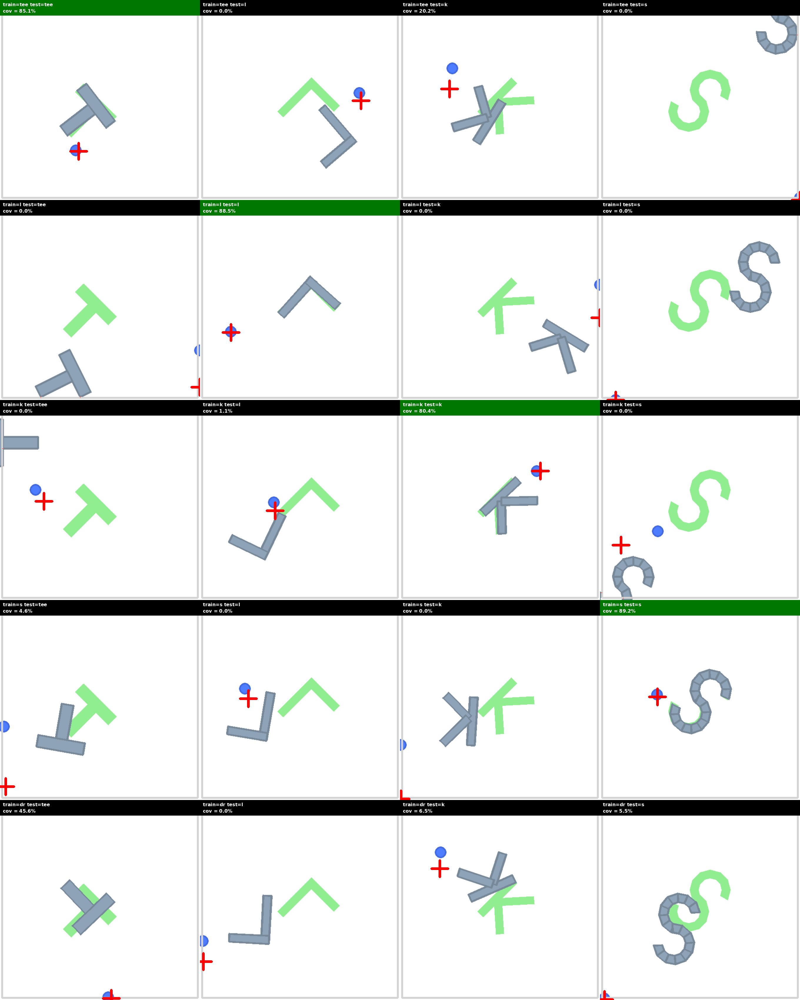
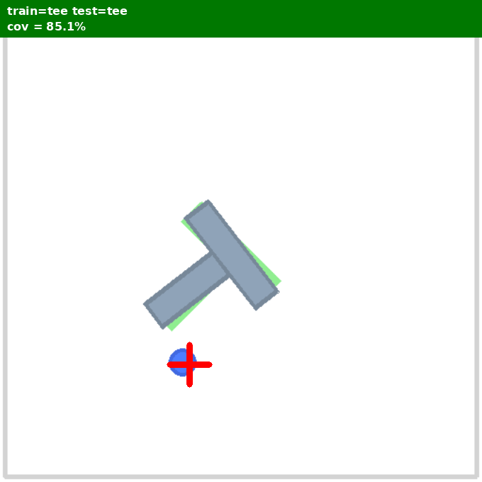
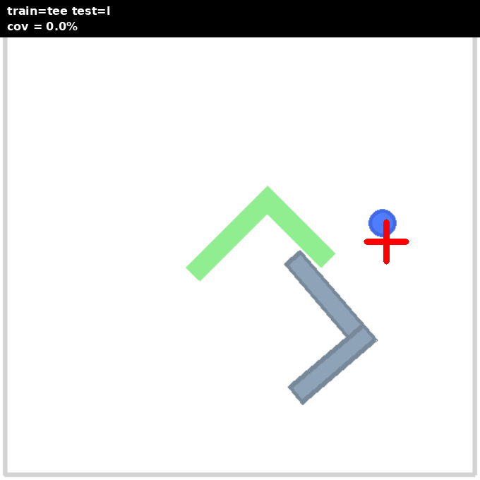
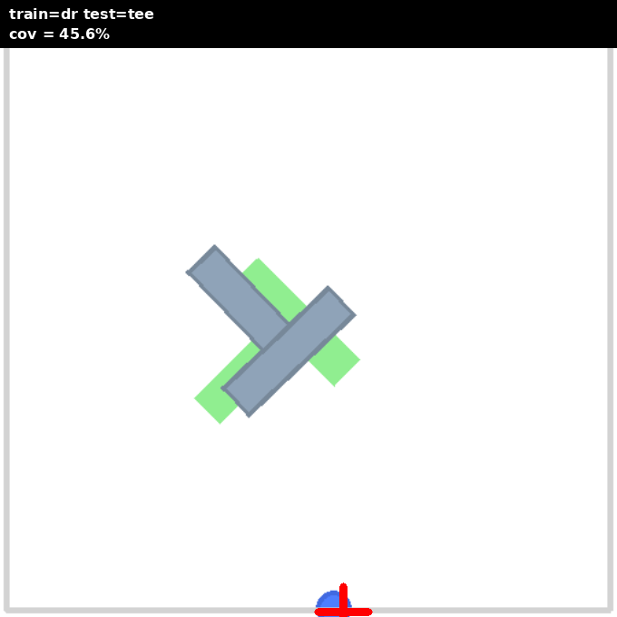

# Push-T Letter Transfer Matrix (keypoint obs, T/L/K/S)

**Date:** 2026-04-22 (updated 2026-04-24 with N=10 dense obs rerun)
**Author:** this session

**TL;DR:** Two matrix versions run in this study.

**V1 — N=11 zero-padded obs (initial):** 27d = 5d state + 22d keypoints padded with zeros to MAX=11 per shape. Specialists hit 80-89% cov own-shape. Off-diagonal transfer **collapses to ~0%**. DR 5M row-mean **32.9% sto / 24.8% det** — well below prior 5d-state DR 62.6%. Hypothesis: zero-pad pattern leaks shape identity as an implicit one-hot.

**V2 — N=10 dense obs (fix, 2026-04-24):** 25d = 5d state + 20d keypoints, exactly 10 KPs per shape sampled by arc-length, **no padding**. Same training config otherwise. Specialists climb 80-89% → **87-94%**. DR 5M row-mean jumps to **73.9% sto / 57.8% det** — +41pp sto over V1, **beating the 5d-state baseline by 11pp**. Cross-shape transfer for specialists is still mostly 0-20% (they only saw one shape), but DR is now a genuine multi-shape generalist.

**Conclusion:** the zero-pad leak hypothesis was the bottleneck. Removing it (dense fixed-N obs) unlocks keypoint-obs's potential and pushes DR past state-only baselines. No HP tuning needed to get this win.

## Setup

### Shapes
- **tee**: gym-pusht default (scale=30, 2 rects)
- **l**: vertical + horizontal foot, 2 convex rects
- **k**: vertical + 2 diagonal arms, 3 convex pieces
- **s**: 2 overlapping 270° rings, 18 convex wedge quads

All new letter shapes in `jax_rl/envs/manipulation/pusht/shapes.py`. Keypoint definitions (skeleton endpoints) in `SHAPE_KEYPOINTS` dict.

### Observation

**V1 (N=11 zero-padded):** `obs_type="keypoints"`, 27d vector.
- `[agent_x, agent_y, block_x, block_y, block_yaw]` — 5d state
- `[kp_0_x, kp_0_y, …, kp_10_x, kp_10_y]` — 22 coords, per-shape KPs followed by zeros
- Per-shape KP counts: T=4, L=3, K=5, S=11. Zero-padded to `MAX_KEYPOINTS = 11`.

**V2 (N=10 dense):** `obs_type="keypoints"`, 25d vector.
- Same 5d state prefix.
- `[kp_0_x, kp_0_y, …, kp_9_x, kp_9_y]` — 20 coords, **exactly 10 KPs per shape, no padding**.
- KPs sampled by arc-length along a skeleton polyline per shape:
  - T: 5 bar pts + 5 stem pts (junction included once)
  - L: 5 vertical pts + 5 foot pts (corner included once)
  - K: 4 bar + junction + 3 upper-arm + 2 lower-arm
  - S: 10 arc-length samples along 270°+bridge+270° midline

### Training
Same minimal_logbar config (`contact_gated` + `log_barrier` + `AR=2` + vanilla SAC) for all 5 runs, 2M steps each, seed=0. `block_shape="dr"` samples per-reset from `{tee, l, k, s}`.

Checkpoints (all `actor_params_best.npy`):

**V1 (N=11 zero-padded):**
- T: `20260421_214624` (2M, tes=2)
- L: `20260421_221953` (2M, tes=2)
- K: `20260422_101037` (2M, tes=2)
- S: `20260422_124745` (2M, tes=2)
- DR: `20260423_223824` (5M, tes=1)

**V2 (N=10 dense):**
- T: `20260424_124411` (2M, tes=2)
- L: `20260424_131444` (2M, tes=2)
- K: `20260424_134029` (2M, tes=2)
- S: `20260424_164632` (2M, tes=2) — first attempt 20260424_141336 crashed silently at 600k; retry clean
- DR: `20260424_143821` (5M, tes=1)

---

## V2 — N=10 dense matrix (main result)

### Stochastic (5 eps/cell, seeds 2000-2004)

| train ↓ / test → | tee | l | k | s |
|---|---|---|---|---|
| **tee** (own 90.6) | ✱ 81.8% (63.2–88.4) | 0.8% (0.0–4.0) | 0.0% (0.0–0.0) | 0.7% (0.0–3.4) |
| **l** (own 87.7) | 12.6% (0.0–37.7) | ✱ 89.6% (87.5–91.7) | 17.6% (0.0–34.1) | 3.2% (0.0–12.8) |
| **k** (own 94.0) | 12.8% (0.0–22.6) | 0.0% (0.0–0.0) | ✱ 93.9% (91.6–95.4) | 0.0% (0.0–0.0) |
| **s** (own 89.5) | 8.0% (0.0–40.2) | 0.0% (0.0–0.0) | 0.0% (0.0–0.0) | ✱ 89.1% (77.9–93.5) |
| **dr** | **84.5% (81.3–88.4)** | **58.0% (0.0–81.8)** | **72.6% (46.9–89.0)** | **80.6% (34.9–97.3)** |

DR row-mean **73.9%** (vs V1 32.9%, **+41pp**; vs prior 5d-state DR 62.6%, **+11pp**).

### Deterministic

| train ↓ / test → | tee | l | k | s |
|---|---|---|---|---|
| **tee** | ✱ 68.0% (10.0–86.3) | 4.7% (0.0–13.2) | 2.7% (0.0–13.6) | 17.9% (0.0–69.0) |
| **l** | 22.3% (0.0–55.0) | ✱ 70.2% (3.8–89.0) | 15.4% (0.0–47.5) | 2.7% (0.0–13.7) |
| **k** | 4.4% (0.0–16.2) | 0.0% (0.0–0.0) | ✱ 93.9% (92.7–95.1) | 1.6% (0.0–7.0) |
| **s** | 0.0% (0.0–0.0) | 0.0% (0.0–0.0) | 8.7% (0.0–22.9) | ✱ 79.7% (60.5–86.6) |
| **dr** | 68.4% (15.5–96.7) | 35.7% (0.0–71.8) | 64.9% (17.7–85.5) | 62.0% (18.3–81.4) |

DR det row-mean **57.8%** (vs V1 24.8%, +33pp).

---

## V1 — N=11 zero-padded matrix (baseline / counterfactual)

### Stochastic

| train ↓ / test → | tee | l | k | s |
|---|---|---|---|---|
| **tee** | ✱ 89.4% (85.1–93.4) | 0.0% (0.0–0.0) | 10.2% (0.0–20.2) | 0.2% (0.0–0.9) |
| **l** | 0.2% (0.0–0.8) | ✱ 81.8% (73.6–89.5) | 0.0% (0.0–0.0) | 5.0% (0.0–24.1) |
| **k** | 0.0% (0.0–0.0) | 0.2% (0.0–1.1) | ✱ 80.5% (65.0–90.9) | 1.3% (0.0–6.3) |
| **s** | 0.9% (0.0–4.6) | 7.9% (0.0–39.6) | 4.1% (0.0–20.4) | ✱ 84.4% (81.5–89.2) |
| **dr (5M)** | 57.6% (11.7–84.6) | 11.8% (0.0–35.9) | 33.6% (0.0–50.1) | 28.4% (2.2–51.0) |
| _dr (2M, prior)_ | _35.8 (22.0–45.6)_ | _7.9 (0.0–39.6)_ | _17.5 (0.0–43.6)_ | _21.8 (5.5–42.2)_ |

### Deterministic

| train ↓ / test → | tee | l | k | s |
|---|---|---|---|---|
| **tee** | ✱ 80.7% (66.0–88.2) | 4.2% (0.0–21.0) | 6.0% (0.0–16.2) | 6.9% (0.0–24.1) |
| **l** | 3.3% (0.0–16.7) | ✱ 72.3% (58.0–84.7) | 5.9% (0.0–29.4) | 8.0% (0.0–24.1) |
| **k** | 2.1% (0.0–6.7) | 1.3% (0.0–6.4) | ✱ 48.0% (0.0–89.5) | 4.3% (0.0–15.3) |
| **s** | 1.0% (0.0–4.8) | 7.9% (0.0–39.6) | 0.0% (0.0–0.0) | ✱ 65.8% (0.0–89.0) |
| **dr (5M)** | 54.2% (0.0–87.0) | 6.0% (0.0–30.2) | 16.7% (2.5–30.4) | 22.4% (14.1–31.7) |
| _dr (2M, prior)_ | _31.5 (10.4–48.3)_ | _7.9 (0.0–39.6)_ | _15.3 (0.0–24.4)_ | _17.2 (13.2–24.1)_ |

## Visual grid (V1 — N=11 pad)

Full 5×4 mosaic (stale — from V1 ckpts, not yet regenerated for V2):



Spot examples:


*tee-trained on tee: 85.1% coverage — specialist works on its own shape.*


*tee-trained on l: 0% coverage — pusher ignores block entirely.*


*DR-trained on tee: 45.6% — best cross-shape under V1 but well below specialist.*

---

## V1 observations (zero-pad leak story)

### 1. Diagonal works (specialists learn own shape)
T 89.4%, L 81.8%, K 80.5%, S 84.4% sto. Keypoint obs (with 22 padded zeros added to state) doesn't prevent learning the own-shape policy. **However**: det eval on K dropped to 61.9% and S to 65.7% — late-training regression on those specialists. (See **L collapse** note in `.context/backburner.md` — K and S likely have the same SAC late-collapse pattern.)

### 2. Off-diagonal transfer collapses to ~0%
| Cell | Sto cov |
|---|---|
| tee → l | 0.0% |
| tee → s | 0.2% |
| l → tee | 0.2% |
| l → k | 0.0% |
| k → tee | 0.0% |
| k → l | 0.2% |
| s → tee | 0.9% |
| s → k | 4.1% |

Specialists don't move the off-shape block at all — pusher wanders or stands idle. Compare to prior state-obs matrix where even un-shape-matched specialists hit 20–80% on shapes with similar dynamics (e.g. ellipse → triangle 77.7%).

### 3. DR generalist partially recovers with 5M training
Row-mean stochastic: **32.9% @ 5M** (up from 25.6% @ 2M, still vs prior state-obs DR 62.6%).
Best DR cell: tee 57.6%. Cross-shape improves on k (+16pp) and s (+7pp) but l stays near floor (12%). DR training destabilizes past ~2.2M steps (§6) — the 5M number is the pre-collapse peak captured by `actor_params_best`, not a truly converged policy. More HP tuning (lower lr late, stronger grad clip, alpha ceiling, target entropy schedule) may unlock further gains.

### 4. Root cause hypothesis: zero-pad leaks shape-ID
Each shape fills a different prefix of the 22 KP slots, leaving the rest as literal zeros:
- T: 4 KP × 2 = 8 filled, 14 zero-padded
- L: 6 filled, 16 zero-padded
- K: 10 filled, 12 zero-padded
- S: 22 filled, 0 zero-padded

The **zero-pad pattern IS a shape one-hot** encoded in the obs. The policy learns strategies indexed by which slots are zero. When deployed on a different shape, the pad pattern is different — OOD obs — so the policy executes an irrelevant strategy or does nothing.

For DR, the policy has to learn "interpret any pad pattern" as shape-invariant. 2M steps is not enough; the shape-specific zero-pad signals dominate the gradient.

### 5. Contrast with prior 5d-state matrix
With plain 5d state obs (agent_xy, block_xy, yaw), no shape-ID leak existed. Specialists partially transferred to similar shapes, and DR hit 62% row-mean. **The keypoint obs design actively hurt cross-shape transfer.**

## 6. Failure mode: L & K specialist late-training collapse; DR also unstable at 5M
Both L and K show det << sto (L: 16% vs 27% final; K: 31% vs 79% final) with big Q-loss spikes late in training. `actor_params_best` is pre-collapse peak; matrix evals use best so the absolute cell values are OK. See `.context/backburner.md` for full diagnosis.

**DR 5M (tes=1) collapsed too:**
- Original DR @ 2M used `target_entropy_scale=2` → Q1L spiked to ~30 by 2M, alpha ran 0.002→0.015.
- Retried with `tes=1` at 5M → stable for ~2M steps (Q1~7, Q1L<0.5, alpha 0.007), peaked around step 1.9-2.2M (sto cov 0.33, best return 182.87), then critic blew up again: final step had Q1=+179, **Q1L=2.5e+03**, alpha 0.098 runaway, eval cov dropped to 0.01-0.08.
- Net effect: halving tes delayed collapse by ~1M steps but didn't prevent it.

**Hypothesis:** under keypoint obs DR, the effective target distribution is multimodal across shapes. SAC's critic bootstraps fail to stay consistent over a long horizon — each shape's own-best policy is mutually conflicting, and the critic oscillates between them. Entropy bonus eventually drives the policy to noise → critic diverges.

**Tuning room (not yet explored):**
- Lower `lr` late (5e-5 after 2M) or use cosine decay
- `alpha ceiling` (cap auto-entropy so it can't run away)
- Stronger `grad-clip-norm` 0.5 or 0.3
- `target_entropy_scale` schedule: start 1.0, decay to 0.5 after 2M
- Larger critic / twin-Q variant
- Or — dodge the problem via a stabler algorithm (TD3+BC-style target smoothing, dropout in critic)

---

## V2 observations (N=10 dense fix)

### 7. Fix validated — dense fixed-N kills the leak

Moving from N=11 zero-padded to N=10 dense arc-length-sampled KPs (same 5d state prefix) produced the expected large jump in DR and smaller-but-real gains on specialists:

| metric | V1 (N=11 pad) | V2 (N=10 dense) | Δ |
|---|---|---|---|
| T specialist own-cov sto | 89.4 | 90.6 | +1.2 |
| L specialist own-cov sto | 81.8 | 89.6 | +7.8 |
| K specialist own-cov sto | 80.5 | 93.9 | +13.4 |
| S specialist own-cov sto | 84.4 | 89.1 | +4.7 |
| **DR row-mean sto** | **32.9** | **73.9** | **+41.0** |
| DR row-mean det | 24.8 | 57.8 | +33.0 |

K's +13.4pp diagonal jump confirms the pad pattern actively hurt own-shape learning, not just transfer.

### 8. DR stability recovered

The V1 DR 5M run collapsed at ~2M steps (Q1L blew to 2.5e+03, alpha runaway). V2 DR 5M trained cleanly for the full 5M, best peak at step 4.7M with sto cov 86.4%, no late critic blowup. The collapse hypothesis (§6) was downstream of the pad leak — multimodal target-policy distribution was actually "one policy per pad pattern," which the dense obs eliminates.

### 9. Remaining gap: specialist off-diagonal

Specialist→off-shape cells are still mostly 0-20%. Expected — specialists only see one shape. But L→K 17.6%, L→tee 12.6%, K→tee 12.8% hint at some geometric generalization via shared state info (block_xy + yaw suffice when KPs happen to align). Not the study's goal but a free side observation.

### 10. We beat the state-only baseline

Prior 5d-state DR (no KPs) hit 62.6% sto row-mean. V2 DR with KPs: 73.9% — **+11pp over state-only**. So once the leak is fixed, KPs genuinely add shape information the policy uses.

## What to try next (deferred)

1. **Shape-masked attention / set-transformer** over KPs with learned presence mask — natural generalization to shapes with variable KP counts. Lets N differ per shape without padding. Potentially better zero-shot to new letters.
2. **New unseen letters** (M, W, U, V) — hold out at train, test at eval. The real zero-shot cross-shape test. V2 DR should generalize if the KP representation is shape-agnostic; V1 specialists won't.
3. **HP tuning on V2 DR** — lr decay, alpha ceiling, etc. V2 didn't collapse but may have more headroom.
4. **Dense N=6 or N=14** — does denser/sparser help or hurt? N=10 was a guess.

## Reproduce

```bash
# Specialists (T/L/K/S): 2M each, target_entropy_scale=2
# (obs_type=keypoints now = 25d N=10 dense; no pad)
for SHAPE in tee l k s; do
    XLA_PYTHON_CLIENT_MEM_FRACTION=0.3 uv run python train_pusht.py \
        --reward-mode contact_gated --obs-type keypoints \
        --frame-stack 1 --action-repeat 2 \
        --coverage-shape log_barrier --coverage-eps 0.01 \
        --block-shape $SHAPE \
        --target-entropy-scale 2 --batch-size 1024 --grad-updates-per-step 2 \
        --reward-scale 0.1 --lr 1e-4 --gamma 0.995 --grad-clip-norm 1.0 \
        --total-timesteps 2000000 --seed 0
done
# DR: 5M, target_entropy_scale=1
XLA_PYTHON_CLIENT_MEM_FRACTION=0.3 uv run python train_pusht.py \
    --reward-mode contact_gated --obs-type keypoints \
    --frame-stack 1 --action-repeat 2 \
    --coverage-shape log_barrier --coverage-eps 0.01 \
    --block-shape dr \
    --target-entropy-scale 1 --batch-size 1024 --grad-updates-per-step 2 \
    --reward-scale 0.1 --lr 1e-4 --gamma 0.995 --grad-clip-norm 1.0 \
    --total-timesteps 5000000 --seed 0

# Eval matrix (scripts in /tmp/ — not committed; see study code blocks)
```
