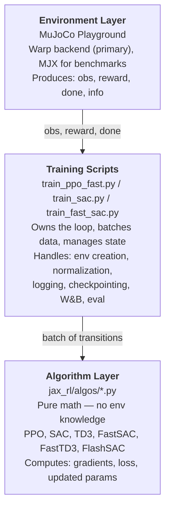

# Architecture

## System Overview

The codebase follows a strict three-layer separation:



**Key invariant:** Algorithms never import or reference environments. They receive batches of `(obs, action, reward, next_obs, done)` and return updated parameters. This makes algorithms reusable across any environment.

---

## Data Flow

### PPO (on-policy)

1. `lax.scan` collects `num_steps` transitions across `num_envs` environments in a single JIT'd call
2. Training script assembles a `RolloutBatch` (shape `[T, E, ...]`)
3. PPO computes GAE advantages, splits into minibatches, runs `num_epochs` of SGD
4. Repeat for `num_updates_per_batch` collect-update cycles per iteration

### Off-policy (SAC, TD3, FastSAC, FastTD3)

1. Python loop: select action, step env, store transition in replay buffer
2. After `min_buffer_size` transitions, begin gradient updates
3. Each env step triggers `grad_updates_per_step` gradient updates (UTD ratio)
4. Each gradient step: sample batch from buffer, compute loss, update params

---

## Config System

Two-level configuration using dataclasses:

- **`TrainConfig`** -- shared fields: `env_name`, `num_envs`, `total_timesteps`, `lr`, `gamma`, `reward_scaling`, `episode_length`, `reset_mode`, `n_frame_stack`, `action_delay_ms`
- **Algo configs** -- algorithm-specific: `PPOConfig`, `SACConfig`, `TD3Config`, `FastSACConfig`, `FastTD3Config`, `FlashSACConfig`

Presets return fully-configured tuples:

```python
# PPO
cfg = get_preset("CheetahRun")  # returns TrainConfig (with cfg.ppo populated)

# Off-policy
cfg, algo_cfg = get_fast_sac_preset("HumanoidRun")  # returns (TrainConfig, FastSACConfig)
```

CLI overrides apply via `dataclasses.replace()`:

```python
cfg = dataclasses.replace(cfg, num_envs=2048, lr=1e-3)
algo_cfg = dataclasses.replace(algo_cfg, batch_size=4096)
```

Each algo config is a standalone dataclass with correct defaults. FastSAC and FastTD3 do not inherit from SAC/TD3 configs because their defaults diverge on nearly every field.

---

## Checkpoint Format

Each checkpoint directory contains:

| File | Purpose |
|------|---------|
| `meta.json` | Full config (TrainConfig + AlgoConfig), algo type, obs/action dims |
| `metrics.csv` | Training curve (step, return, loss, etc.) |
| `actor_params.npy` | Actor parameters for inference (deploy, video recording) |
| `orbax/` | Full training state for resume (actor, critic, optimizer, norm state) |

`record_video.py` reads `meta.json` to reconstruct the correct network architecture and loads `actor_params.npy` for rollouts.

---

## Physics Backends

MuJoCo Playground supports two backends via the `impl` flag:

| Backend | Accessed via | Geometry support | Status |
|---------|-------------|-----------------|--------|
| **Warp** | `impl="warp"` | Full (cylinders, meshes, boxes) | **Primary.** Used for all Go2 envs and new development. |
| **MJX** (JAX-native) | `impl="jax"` | Spheres, capsules, planes | DM Control benchmarks (Cartpole, Cheetah, Humanoid). Go2 MJX env archived. |

Both backends work with the same MuJoCo Playground API — `impl` only swaps the physics step. Policy networks, `vmap`, `jit`, and autodiff stay in JAX regardless of backend.

---

## Wrapper Pipeline

Raw environments are wrapped in a fixed order:

```
Raw env (MuJoCo Playground)
  → ActionDelayWrapper      (if action_delay_ms > 0 or action_delay_range_ms set)
  → FrameStackWrapper       (if n_frame_stack > 1)
  → VmapWrapper             (vectorize across num_envs)       ┐
  → EpisodeWrapper          (episode length tracking)         │  reset_mode="legacy"
  → AutoResetWrapper        (auto-reset, cached initial data) ┘
    or
  → DomainRandWrapper       (fresh reset + per-episode DR)    ┐  reset_mode="per_step"
```

Action-modifying wrappers are applied first, then observation-modifying wrappers, then the training wrappers.

Wrappers are configured from `TrainConfig` fields. The pipeline is built by `build_wrapper_pipeline()` and applied by `apply_wrapper_pipeline()` in `jax_rl/envs/wrappers/pipeline.py`.
